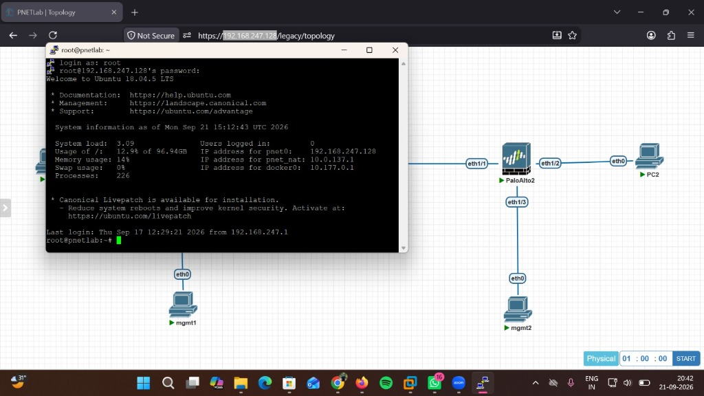
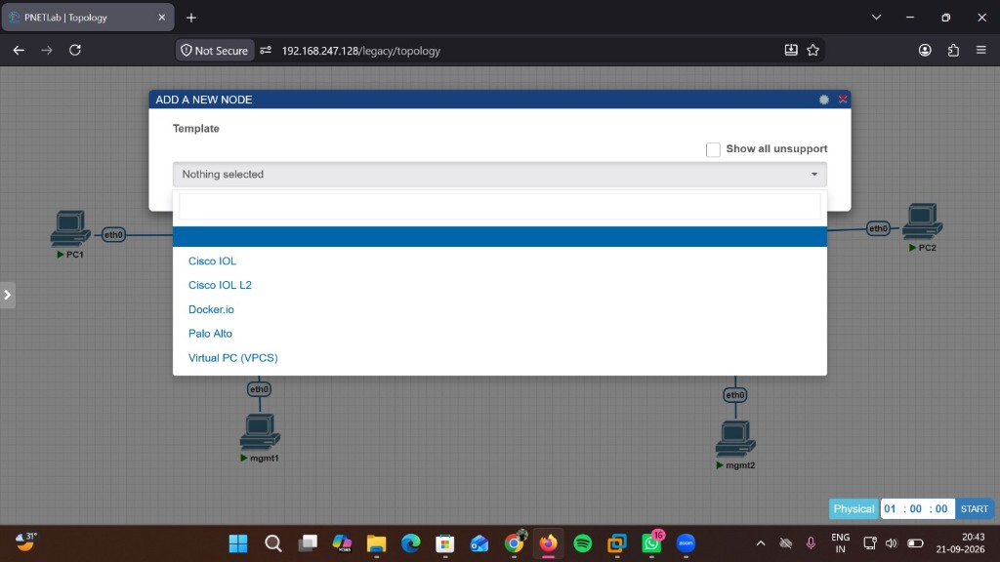
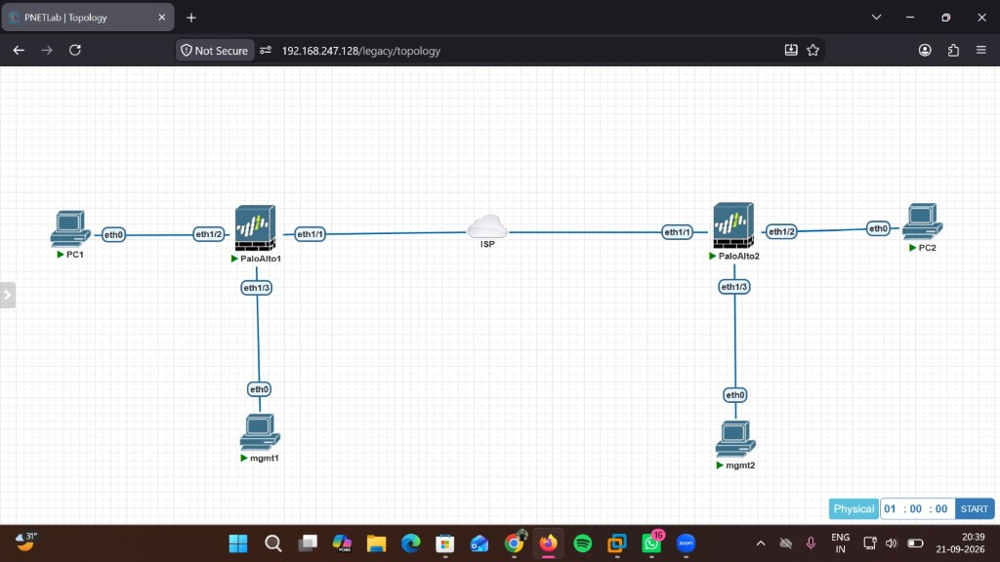
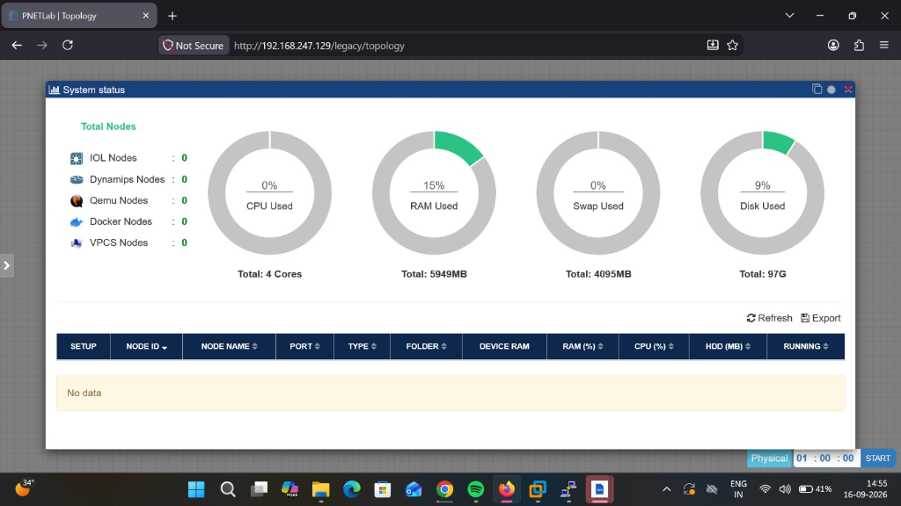

# Site-to-Site VPN Configuration

## Team Members

| Name | Role |
|------|------|
| Vedansh Gupta | Network Configuration & Project Lead |
| Vishal Goswami | IPSec Tunnel Setup & Testing |
| Vishal Sharma | Firewall Rules & Security |
| Vivek Kumar | Simulation & Python Scripts |
| Yash Sharma | Documentation & Dashboard |

---

## Project Description

This project shows how to set up a **Site-to-Site VPN** between two office networks using IPSec and strongSwan. Site-A is the HQ and Site-B is the branch. The idea is simple -- both sites are on different networks but after the VPN tunnel is up they can talk to each other as if they are on the same LAN. Includes real config files, iptables firewall scripts, a Python simulation to test connectivity, and a browser dashboard.

---

## Synopsis

**Title:** Site-to-Site VPN Configuration using IPSec (strongSwan)

**Objective:**
To connect two geographically separate networks (Site-A and Site-B) over the internet using an encrypted IPSec tunnel, so that hosts on both sides can communicate with each other securely.

**Networks:**

| Site | LAN | Public IP | Role |
|------|-----|-----------|------|
| Site-A | 192.168.1.0/24 | 203.0.113.1 | Headquarters |
| Site-B | 192.168.2.0/24 | 203.0.113.2 | Branch Office |

**Technologies Used:**
- Protocol: IPSec with IKEv2
- VPN Software: strongSwan (Linux)
- Encryption: AES-256
- Integrity: SHA-256
- Key Exchange: Diffie-Hellman (modp2048)
- Firewall: iptables
- Simulation/Testing: Python 3

**How the tunnel works:**
1. Both routers verify each other using a Pre-Shared Key (PSK)
2. IKE Phase 1 builds a secure control channel between gateways
3. IKE Phase 2 negotiates the actual data tunnel (IPSec SA)
4. All traffic between Site-A LAN and Site-B LAN goes encrypted through the tunnel
5. Other internet traffic goes out normally via NAT

**Result:** Any host on Site-A can ping or connect to any host on Site-B securely through the VPN. Works both ways.

---

## Folder Structure

    site-to-site-vpn/
    ├── site-a/
    │   ├── ipsec.conf          strongSwan config for Site-A
    │   ├── ipsec.secrets       pre-shared key
    │   └── firewall_rules.sh   iptables rules
    ├── site-b/
    │   ├── ipsec.conf
    │   ├── ipsec.secrets
    │   └── firewall_rules.sh
    ├── simulation/
    │   ├── vpn_simulator.py    simulates IKE Phase 1 & 2
    │   ├── packet_tester.py    simulates ping across VPN
    │   └── network_nodes.py    network config for both sites
    ├── dashboard/
    │   ├── index.html          VPN status page (open in browser)
    │   ├── style.css
    │   └── app.js
    └── docs/
        ├── setup_guide.md
        └── troubleshooting.md

---

## Run the Simulation

    python simulation/vpn_simulator.py
    python simulation/packet_tester.py

Open dashboard/index.html in browser to see VPN status.

---

## Real Deployment (Linux)

1. apt install strongswan
2. Copy ipsec.conf and ipsec.secrets to /etc/ on both machines
3. Run firewall_rules.sh on both
4. ipsec start
5. Check: ipsec status

See docs/setup_guide.md for full steps.

---

## Notes

- Change the PSK in ipsec.secrets before using this in production
- Tested on Ubuntu 22.04
- UDP 500 and 4500 must be open in your firewall/security group

---

## Lab Setup on PNETLab

This project was built and tested on a **PNETLab server** running on a local network. Below are the steps followed to set up and access the lab.

### Step 1 — Access PNETLab Server via SSH

Open terminal/PuTTY and SSH into the PNETLab server:

    ssh root@192.168.247.128
    Password: (enter root password)

The server runs Ubuntu 18.04.5 LTS. After login you can see system info like CPU, RAM, and IP addresses.

---

### Step 2 — Open PNETLab in Firefox Browser

Open Firefox and go to:

    http://192.168.247.128/legacy/topology

Login with your PNETLab credentials (admin/admin by default).

---

### Step 3 — Create Topology / Add Nodes

In the topology canvas:
1. Right click on empty area > Add a New Node
2. Select template — we used:
   - **Palo Alto** (for India and Dubai firewalls)
   - **Virtual PC (VPCS)** (for PC1 and PC2)
   - **Cisco IOL** (for ISP router)

---

### Step 4 — Connect Devices and Build Topology

Connect the nodes as per the topology:

    PC1 (eth0) ---- PaloAlto1 (eth1/2) LAN side
    PaloAlto1 (eth1/1) WAN ---- ISP ---- PaloAlto2 (eth1/1) WAN
    PaloAlto2 (eth1/2) ---- PC2 (eth0)
    Both firewalls have eth1/3 connected to management PCs

Final topology looks like this:

---

### Step 5 — Check System Status

Before starting devices, check server resources:
- More > System Status in PNETLab menu
- Make sure enough RAM and CPU is available

Our server had: 4 Cores, 5949MB RAM, 97GB Disk

---

### Step 6 — Start All Devices

Click **START** button on each device or use the global Start button.
Wait for all devices to turn green/active.

---

### Step 7 — Configure Palo Alto Firewalls

Once devices are running, access Palo Alto GUI:

    India PA:  https://192.168.10.1   (from mgmt1 PC)
    Dubai PA:  https://192.168.20.1   (from mgmt2 PC)

Then configure:
- Interfaces (LAN, WAN, Tunnel)
- Zones
- Virtual Router + Static Routes
- IKE Gateway + Crypto Profile
- IPSec Tunnel + Proxy IDs
- Security Policies
- NAT Exemption

---

### Step 8 — Verify VPN Tunnel

In Palo Alto CLI:

    show vpn ike-sa
    show vpn ipsec-sa

On PC1:

    ping 192.168.20.10

On PC2:

    ping 192.168.10.10

